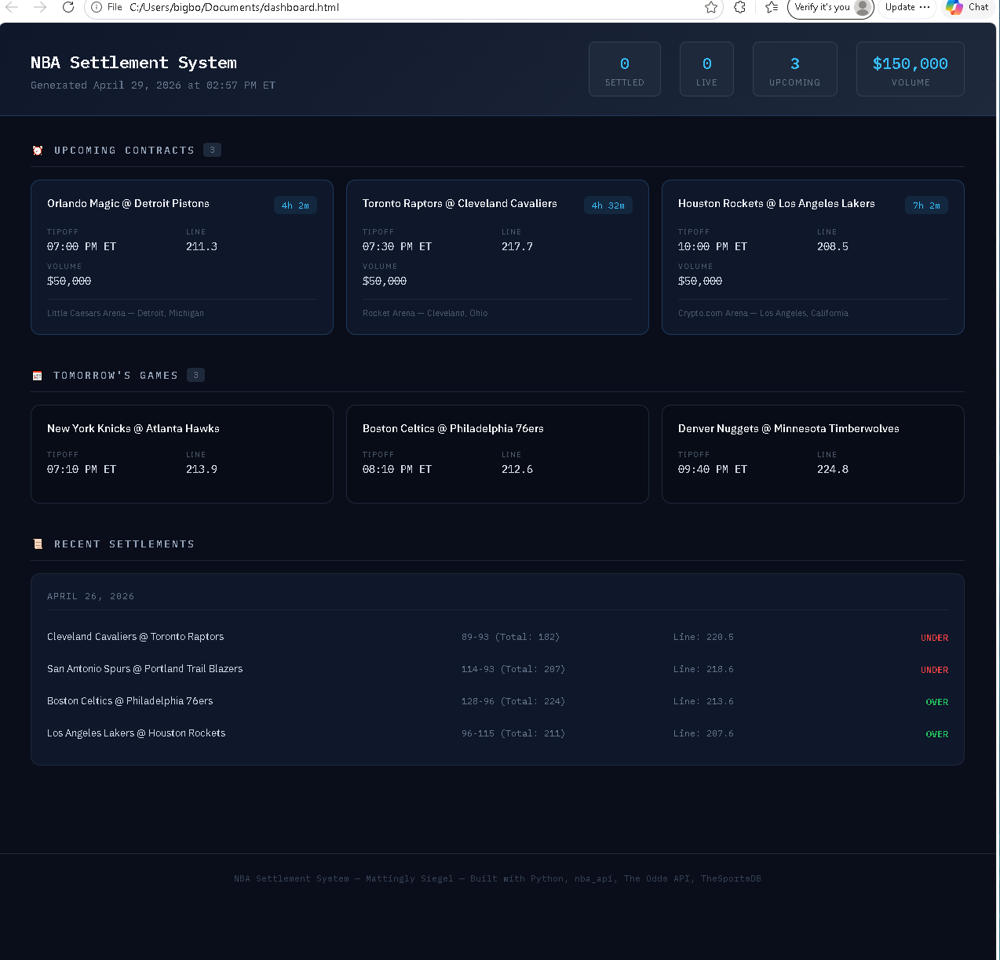

# NBA Settlement System
### Author: Mattingly Siegel
## Live Dashboard Preview

> Run `python generate_dashboard.py` to generate a live updated version locally.

A live automated settlement system that pulls real data from three APIs 
to track, grade, and report NBA prediction market contracts in real time.

## How To Run
pip install requests pandas pytz nba_api

python settlement_system.py

## Data Sources
- **The Odds API** — real consensus over/under lines
- **nba_api** — real live and final NBA scores  
- **TheSportsDB** — venue and location data

## Files
- `settlement_system.py` — main settlement engine
- `db.py` — database module for storing contract lines
- `generate_dashboard.py` — generates the live HTML dashboard
- `dashboard.html` — sample dashboard output (click to preview)

## Background
Built as preparation for a role in prediction market operations. 
Designed to mirror real settlement workflows in a CFTC-regulated 
exchange environment.
